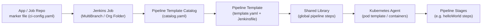
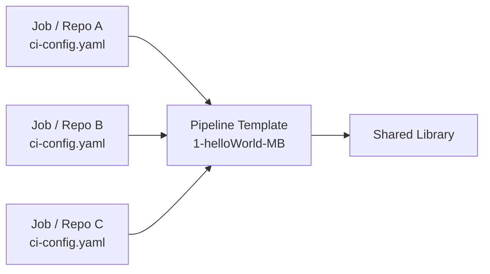

# 🧪 About

This repository contains **CloudBees CI Pipeline Templates**, intended for reuse across CI/CD projects. These templates can be referenced from:

- [Marker files](https://docs.cloudbees.com/docs/cloudbees-ci/latest/pipelines/pipeline-as-code#custom-pac-scripts) in:
  - [MultiBranch Pipeline Projects](https://docs.cloudbees.com/docs/cloudbees-ci/latest/pipelines/pipeline-as-code#_multibranch_pipeline_projects)
  - [Pipeline Organization Folders](https://docs.cloudbees.com/docs/cloudbees-ci/latest/pipelines/pipeline-as-code#_organization_folders)
  - [Pipeline Template Catalogs](https://docs.cloudbees.com/docs/cloudbees-ci/latest/pipeline-templates-user-guide/)

### ✨ Purpose

- Provide an opinionated CI pipeline structure driven by reusable templates and marker files (see diagram below)
- Simplify pipeline adoption with minimal external dependencies — a Jenkins Shared Library plus a Pipeline Template Catalog
- Keep templates thin: the Jenkinsfile in each template mostly loads a Shared Library and delegates the actual pipeline logic to it
* Governance focus: *Centralized governance and lifecycle control for pipelines and Jenkinsfile templates*
* Developer-friendly: *Shared, centrally managed pipeline templates for consistent Jenkinsfile design*
* Ops/Enterprise: *Enterprise-wide standardization and centralized control of pipeline definitions and templates*

> For a fuller real-world example (Spring Boot app + custom marker file + Docker build), see the external reference implementation at [cb-ci-templates/ci-templates](https://github.com/cb-ci-templates/ci-templates) — it is not part of this repository.

### Pipeline Template Catalog Design



---

## 📦 Templates in This Repository

| Template                                                     | Description                                                                                                                                                                                          |
| ------------------------------------------------------------- | ------------------------------------------------------------------------------------------------------------------------------------------------------------------------------------------------ |
| [`0-helloWorld`](templates/0-helloWorld)                     | Loads a Shared Library and runs on a Kubernetes agent. Executes custom `helloWorld` steps across two explicit stages (`Stage1`, `Stage2`) inside the `maven` container.                              |
| [`1-helloWorld-MB`](templates/1-helloWorld-MB) | Fully externalized pipeline: the Jenkinsfile only loads the Shared Library and delegates to the `pipelineTemplateHelloWorld('ci-config.yaml')` global step. `template.yaml` sets `templateType: MULTIBRANCH`, intended for MultiBranch / marker-file use. |

`0-helloWorld` declares `firstname`/`lastname` parameters; `1-helloWorld-MB` instead declares `repoName`, `organisation`, and `githubToken` parameters that drive its MultiBranch GitHub branch source — see each template's own `template.yaml` and README for details.

---

## ⚡ Quick Start

1. Register this repository as a [Pipeline Template Catalog](https://docs.cloudbees.com/docs/cloudbees-ci/latest/pipeline-templates-user-guide/) in CloudBees CI, pointing at [`catalog.yaml`](catalog.yaml).
2. Reference a template (e.g. `0-helloWorld` or `1-helloWorld-MB`) from a MultiBranch Pipeline, Organization Folder, or marker file.
3. Supply the required template parameters when the template is instantiated (`firstname`/`lastname` for `0-helloWorld`; `repoName`/`organisation`/`githubToken` for `1-helloWorld-MB`).

---

## 🗂️ Repository Structure

This repository follows the recommended layout for Pipeline Template Catalogs. Templates are under `/templates`, and each contains:

- `Jenkinsfile`: A Pipeline definition (Declarative or Scripted).
- `template.yaml`: Template parameters (required only for Template Catalogs).

```text
├── README.md
├── catalog.yaml                    # Pipeline Template Catalog descriptor
└── templates/
    ├── 0-helloWorld/
    │   ├── Jenkinsfile              # Main pipeline file
    │   ├── README.md
    │   └── template.yaml            # Template descriptor (parameters)
    └── 1-helloWorld-MB/
        ├── Jenkinsfile
        ├── README.md
        └── template.yaml            # templateType: MULTIBRANCH
```

---

## 🧩 Custom Marker Files & Pipeline Templates

Many jobs (or repos) can reuse the same template — a marker file in each job/repo simply points to the template it wants:



---

## ⚙️ Job Settings: Branch Suppression Strategies

Suppress automatic triggering for all branches, except PRs:

```yaml
strategy:
  namedBranchesDifferent:
    defaultProperties:
      - suppressAutomaticTriggering:
          triggeredBranchesRegex: ^.*$
          strategy: INDEXING
    namedExceptions:
      - named:
          name: PR-\d+
          props:
            - suppressAutomaticTriggering:
                triggeredBranchesRegex: ''
                strategy: NONE
```

---

## 📚 Documentation & Videos

### Pipeline Best Practices

- 📝 [Just Enough Pipeline](https://www.jenkins.io/blog/2021/10/26/just-enough-pipeline/)
- 📘 [CloudBees CI Pipeline Best Practices](https://docs.cloudbees.com/docs/cloudbees-ci/latest/pipelines/pipeline-best-practices)
- 🎥 [Scripted vs. Declarative Pipelines – YouTube](https://www.youtube.com/watch?v=GJBlskiaRrI=)
- 🧠 [Scripted vs. Declarative - Blog](https://e.printstacktrace.blog/jenkins-scripted-pipeline-vs-declarative-pipeline-the-4-practical-differences/)

### Multibranch Pipelines

- 🎥 [How to Create a GitHub Multibranch Pipeline – YouTube](https://www.youtube.com/watch?v=ZWwmh4gqia4)
- 📘 [CloudBees Docs: Multibranch Pipelines](https://docs.cloudbees.com/docs/cloudbees-ci/latest/pipelines/pipeline-as-code#_multibranch_pipeline_projects)

### Template Catalogs

- 🎥 [Pipeline Template Catalogs – YouTube](https://www.youtube.com/watch?v=pPwI_kTSCmA)
- 📘 [Pipeline Template Catalogs Docs](https://docs.cloudbees.com/docs/cloudbees-ci/latest/pipeline-templates-user-guide/)

### Organization Folders

- 🎥 [Create GitHub Org Folder – YouTube](https://www.youtube.com/watch?v=w5YupbQ1vHI)
- 📘 [CloudBees Docs: Org Folders](https://docs.cloudbees.com/docs/cloudbees-ci/latest/pipelines/pipeline-as-code#_organization_folders)

### Marker Files

- 📘 [Marker Files](https://docs.cloudbees.com/docs/cloudbees-ci/latest/pipelines/pipeline-as-code#custom-pac-scripts)
- 🧠 [Using Marker Files for Governance](https://www.cloudbees.com/blog/ensuring-corporate-standards-pipelines-custom-marker-files)

### GitHub App Authentication

- 🔐 [Using GitHub App Authentication](https://docs.cloudbees.com/docs/cloudbees-ci/latest/traditional-admin-guide/github-app-auth)
